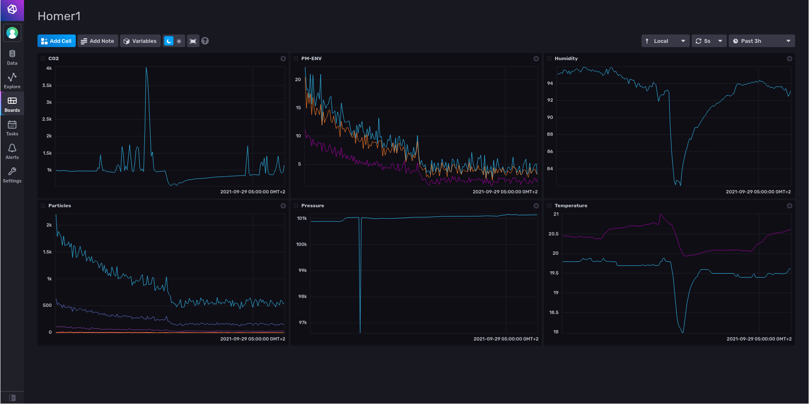
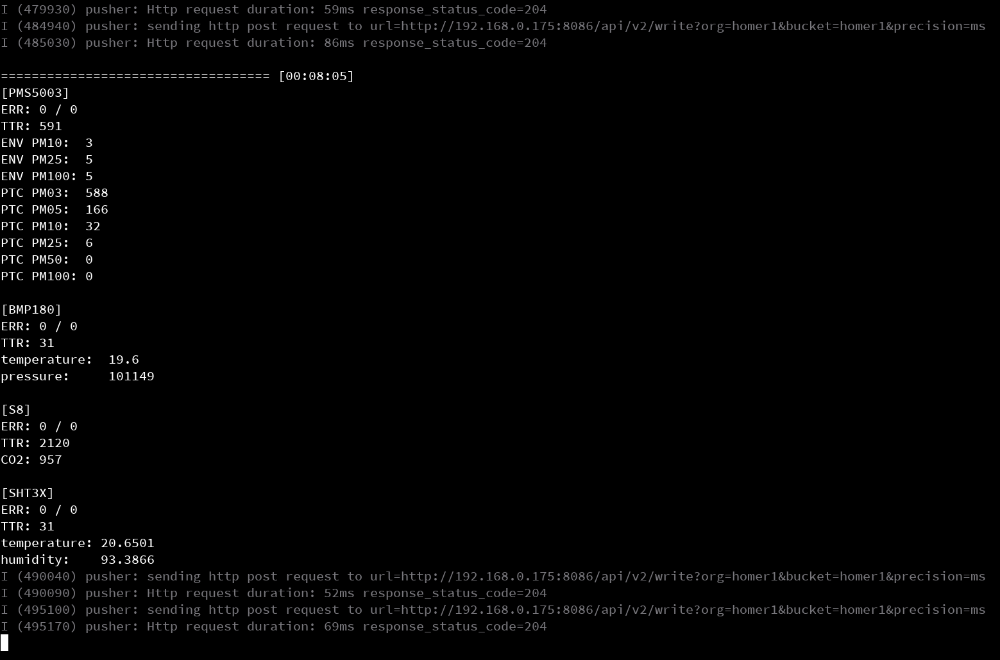

## What?
A project to read out sensors connected to ESP32 and write to InfluxDB.
ESP-IDF based.

Want something proper? have a look at https://gitlab.com/UncleRus/esp-idf-lib

## Sensors:
- BMP180
- SHT3X
- S8 (Senseair)
- PMS5003

## Warning!
- Not necessarily power consumption friendly.
- Not necessarily memory / stack friendly.
- SHT3X takes no calibration.
- Sensor modes are not configurable, everything about sensor configuration is hard-coded.

### References

Some BMP180 code stolen from: https://github.com/krzychb/bmp180-tests [APACHE-2.0]

Some S8 code stolen from: https://github.com/SFeli/ESP32_S8/blob/master/ESP32_S8_01.ino

### Screenshots

