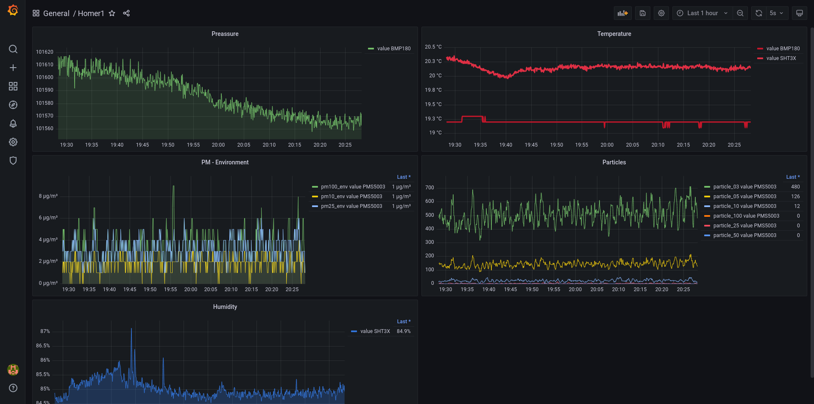

## What?

A project to read out sensors connected to ESP32 and write to InfluxDB and expose for Prometheus. ESP-IDF based.

Raspberry Pi auto configuration included (for Grafana, Prometheus and InfluxDB).

Sensors:

- BMP180
- SHT3X
- S8 (SenseAir)
- PMS5003
- SGP30 eCO2

## How?

- Clone this project.
- Setup [esp idf](1) locally.
- Run `idf.py menuconfig`. In homer1 menu:
  - Wifi: optionally set Wifi SSID and password or disable wifi for debugging.
  - Reporting: optionally enable [InfluxDB](https://www.influxdata.com/) and
    [Prometheus](https://prometheus.io/).
  - Sensors: enable the sensors you're planning to connect. Configure and take
    note of the pins you will connect the sensors to here.
  - Display: if you have an e-paper [driver](https://www.waveshare.com/wiki/E-Paper_ESP32_Driver_Board)
    board, enable it here, and configure the pin used for interrupt signal
    comming from driver board to the main esp32. If you don't have a driver
    board nonetheless but would like to write the sensor readings to I2c bus
    you can still use this functionality.
- Connect the sensors to the pins you configured above. All I2C sensors go to
  the same pins. S8 and PMS5003 each go to different pins because without a
  mux, UART can only support a single device.
- Connect the power to esp32 and see the readings in serial console or on
  e-paper.

### e-paper display

The Arduino file is located in [displayer\_esp32](displayer_esp32) directory.
It's writetn for a 7.5 waveshare
[e-paper display](https://www.waveshare.com/product/displays/7.5inch-e-paper.htm),
using the [driver](https://www.waveshare.com/wiki/E-Paper_ESP32_Driver_Board) board.
A proper UI is TBD and not yet written.

### Prometheus / InfluxDB / Grafana

You can find the configuration scripts for InfluxDB and Prometheus on a raspberry
pi in [raspberry](./raspberry/) directory. If you're not using raspberry you can
still get the grafana dashboard scripts from here.

## ROADMAP

- Make it power consumption friendly.
- SHT3X takes no calibration.
- SGP30 causes panic in interrupt handler of i2c.

#### References

Some BMP180 code stolen from:
[krzychb/bmp180-tests](https://github.com/krzychb/bmp180-tests) [APACHE-2.0] 
Some S8 code stolen from:
[SFeli/ESP32_S8](https://github.com/SFeli/ESP32_S8/blob/master/ESP32_S8_01.ino) 
Some Prometheus ideas got from:
[polyfloyd/esp32-sensornode](https://github.com/polyfloyd/esp32-sensornode)

## Screenshots

InfluxDB:

 
 

Grafana:

 
 

Serial output:

